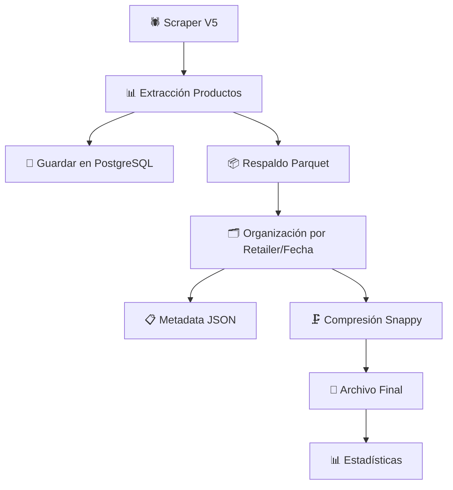

# 📦 Sistema de Respaldo Parquet

## 🎯 Objetivo

Sistema de respaldo automático que guarda **datos crudos** de los scrapers en archivos Parquet organizados por retailer y fecha, proporcionando un respaldo completo y eficiente para análisis posterior.

## 🏗️ Arquitectura del Sistema

### **Flujo de Respaldo Integrado**



### **Estructura de Carpetas**

```
data/parquet/
├── falabella/
│   ├── 2025-09-03/
│   │   ├── smartphones_20250903_143022.parquet
│   │   ├── laptops_20250903_144511.parquet
│   │   ├── televisores_20250903_151234.parquet
│   │   └── metadata_20250903.json
│   ├── 2025-09-04/
│   │   ├── smartphones_20250904_090015.parquet
│   │   └── metadata_20250904.json
│   └── ...
├── ripley/
│   ├── 2025-09-03/
│   │   ├── smartphones_20250903_145530.parquet
│   │   ├── gaming_20250903_152200.parquet
│   │   └── metadata_20250903.json
│   └── ...
├── paris/
└── mercadolibre/
```

## 🚀 Implementación

### **1. Core System (`core/parquet_backup_system.py`)**

```python
from core.parquet_backup_system import save_scraper_backup, get_backup_stats

# Guardar respaldo desde scraper
result = save_scraper_backup(
    retailer="falabella",
    category="smartphones", 
    products=extracted_products,
    metadata={
        "session_id": "scraping_session_001",
        "source_urls": ["https://falabella.com/smartphones"],
        "execution_time": 45.2,
        "success_rate": 0.98
    }
)
```

### **2. Integración Automática en Base Scraper**

El sistema se integra automáticamente en `portable_orchestrator_v5/core/base_scraper.py`:

```python
# 7. Guardar respaldo en Parquet (datos crudos)
if PARQUET_BACKUP_AVAILABLE and products:
    backup_result = save_scraper_backup(
        retailer=self.retailer,
        category=category,
        products=products,
        metadata=backup_metadata
    )
```

### **3. Características Técnicas**

#### **Formato de Datos**
- **Formato**: Apache Parquet con compresión Snappy
- **Optimización**: Tipos de datos optimizados para analytics
- **Compatibilidad**: Pandas, Apache Spark, Dask, BI tools

#### **Campos Automáticos**
- `backup_timestamp`: Timestamp del respaldo
- `backup_id`: ID único del respaldo (8 chars)
- Todos los campos originales del scraper preservados

#### **Metadata JSON**
```json
{
  "date": "2025-09-03",
  "retailer": "falabella", 
  "backups": [
    {
      "retailer": "falabella",
      "category": "smartphones",
      "timestamp": "2025-09-03T14:30:22",
      "products_count": 156,
      "file_size_mb": 2.34,
      "file_path": "data/parquet/falabella/2025-09-03/smartphones_20250903_143022.parquet",
      "scraping_session_id": "session_001",
      "execution_time_seconds": 45.2,
      "success_rate": 0.98,
      "errors": [],
      "warnings": ["Algunos precios desactualizados"]
    }
  ]
}
```

## 🛠️ Utilidades de Gestión

### **Script de Gestión (`scripts/maintenance/parquet_manager.py`)**

#### **Estadísticas de Respaldos**
```bash
python scripts/maintenance/parquet_manager.py stats
```
Muestra:
- Total de retailers, archivos y tamaño
- Detalles por retailer
- Respaldos más antiguos/recientes

#### **Listar Respaldos Recientes**
```bash
# Todos los retailers (7 días)
python scripts/maintenance/parquet_manager.py list

# Específico por retailer (15 días)
python scripts/maintenance/parquet_manager.py list --retailer falabella --days 15
```

#### **Conversión a Otros Formatos**
```bash
# Convertir a CSV
python scripts/maintenance/parquet_manager.py to-csv data/parquet/falabella/2025-09-03/smartphones_20250903_143022.parquet

# Convertir a Excel
python scripts/maintenance/parquet_manager.py to-excel data/parquet/falabella/2025-09-03/smartphones_20250903_143022.parquet --output smartphones_analysis.xlsx
```

#### **Análisis de Archivos**
```bash
python scripts/maintenance/parquet_manager.py analyze data/parquet/falabella/2025-09-03/smartphones_20250903_143022.parquet
```
Proporciona:
- Dimensiones y tamaño en memoria
- Información de columnas (tipos, nulos, únicos)
- Top marcas, rangos de precios, etc.

#### **Limpieza Automática**
```bash
# Limpiar respaldos > 30 días
python scripts/maintenance/parquet_manager.py cleanup --days 30
```

#### **Información Detallada**
```bash
# Info de retailer para hoy
python scripts/maintenance/parquet_manager.py info falabella

# Info para fecha específica
python scripts/maintenance/parquet_manager.py info ripley --date 2025-09-03
```

## 📊 Casos de Uso

### **1. Análisis Histórico de Precios**
```python
import pandas as pd
import glob

# Leer todos los smartphones de falabella del último mes
files = glob.glob("data/parquet/falabella/*/smartphones_*.parquet")
dfs = [pd.read_parquet(f) for f in files]
smartphones_history = pd.concat(dfs)

# Análisis de evolución de precios
price_evolution = smartphones_history.groupby(['nombre', 'backup_timestamp'])['precio_normal'].mean()
```

### **2. Comparación Cross-Retailer**
```python
# Cargar datos de múltiples retailers
falabella_data = pd.read_parquet("data/parquet/falabella/2025-09-03/smartphones_20250903_143022.parquet")
ripley_data = pd.read_parquet("data/parquet/ripley/2025-09-03/smartphones_20250903_145530.parquet")

# Comparar precios por marca
comparison = pd.merge(
    falabella_data[['nombre', 'marca', 'precio_normal']],
    ripley_data[['nombre', 'marca', 'precio_normal']], 
    on=['nombre', 'marca'], 
    suffixes=['_falabella', '_ripley']
)
```

### **3. Recuperación de Datos**
```python
from core.parquet_backup_system import ParquetBackupSystem

system = ParquetBackupSystem()

# Listar respaldos disponibles
backups = system.list_backups(retailer="falabella", days_back=30)

# Leer respaldo específico
df = system.read_backup(backups[0]['path'])
```

### **4. Integración con BI Tools**
- **Power BI**: Conectar directamente a archivos Parquet
- **Tableau**: Usar connector de Parquet
- **Apache Spark**: Lectura nativa de Parquet para big data analytics

## ⚙️ Configuración

### **Variables de Configuración**
```python
# En core/parquet_backup_system.py
class ParquetBackupSystem:
    def __init__(self):
        self.compression = 'snappy'        # Compresión utilizada
        self.max_file_size_mb = 100        # Tamaño máximo por archivo
        self.max_age_days = 30             # Días de retención
```

### **Variables de Entorno**
```bash
# En .env (opcional)
PARQUET_BACKUP_PATH=data/parquet          # Path base para respaldos
PARQUET_COMPRESSION=snappy                # Tipo de compresión
PARQUET_MAX_AGE_DAYS=30                   # Días de retención
```

## 🚀 Benefits del Sistema

### **Ventajas del Formato Parquet**
- **Compresión**: 70-90% menor que CSV
- **Velocidad**: 10-100x más rápido que CSV para analytics  
- **Tipado**: Preserva tipos de datos originales
- **Compatibilidad**: Estándar en el ecosistema big data

### **Organización Inteligente**
- **Por Retailer**: Facilita análisis por fuente
- **Por Fecha**: Permite análisis temporal
- **Por Categoría**: Segmentación por tipo de producto
- **Metadata**: Contexto completo de cada respaldo

### **Recuperación de Desastres**
- **Respaldo Completo**: Datos crudos preservados
- **Independiente**: No depende de PostgreSQL
- **Versionado**: Múltiples snapshots en el tiempo
- **Portable**: Archivos autónomos y transferibles

## 🔧 Troubleshooting

### **Error: "pyarrow not installed"**
```bash
pip install pyarrow
```

### **Error: "Permission denied"**
- Verificar permisos de escritura en directorio `data/parquet/`
- En Windows, ejecutar como administrador si es necesario

### **Archivos muy grandes**
- El sistema automáticamente divide archivos > 100MB
- Configurar `max_file_size_mb` según necesidades

### **Memoria insuficiente**
- Procesar archivos Parquet en chunks:
```python
import pandas as pd
for chunk in pd.read_parquet('large_file.parquet', chunksize=1000):
    process(chunk)
```

## 📈 Métricas y Monitoreo

### **Métricas Automáticas**
- Productos respaldados por día
- Tamaño de respaldos por retailer
- Tiempo de ejecución por categoría
- Tasa de éxito por scraper

### **Alertas Recomendadas**
- Respaldos no creados en 24h
- Tamaño de respaldos excesivamente grande/pequeño
- Errores recurrentes en respaldos
- Espacio en disco < 1GB

---

**🎉 Sistema de Respaldo Parquet completamente implementado y operativo**

Para más detalles técnicos, revisar:
- `core/parquet_backup_system.py` - Sistema principal
- `tests/integration/test_parquet_backup.py` - Tests completos
- `scripts/maintenance/parquet_manager.py` - Utilidades de gestión