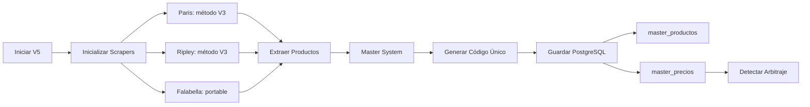

# 🚀 Portable Orchestrator V5 - Sistema de Scraping Avanzado

## 📋 Resumen del Proyecto

Sistema V5 de scraping multi-retailer con integración completa al Master System y PostgreSQL. Implementa métodos de extracción optimizados basados en los scrapers V3/V4 funcionales y el portable scraper para Falabella.

### ✅ Estado Actual: FUNCIONAL

- **Productos extraídos**: 150 por ciclo (configurable)
- **Retailers activos**: Paris, Ripley, Falabella
- **Base de datos**: PostgreSQL con Master System
- **Métodos de extracción**: V3/Portable verificados

## 🏗️ Arquitectura V5

```
scraper_v5_project/
├── 📦 portable_orchestrator_v5/           # Núcleo del sistema V5
│   ├── core/                              # Sistema base
│   │   ├── base_scraper.py               # Clase base con Playwright
│   │   ├── field_mapper.py               # ETL y mapeo de campos
│   │   ├── exceptions.py                 # Excepciones personalizadas
│   │   └── tier_manager.py               # Sistema de tiers
│   │
│   ├── scrapers/                          # Scrapers específicos
│   │   ├── paris_scraper_v5.py           # Paris con método V3
│   │   ├── ripley_scraper_v5.py          # Ripley con método V3
│   │   ├── falabella_scraper_v5.py       # Falabella con método portable
│   │   └── falabella_scraper_v5_fixed.py # Versión corregida
│   │
│   └── ml/                                # Machine Learning (futuro)
│       └── failure_detector.py            # Detector de fallos ML
│
├── 📊 test_v5_production_3min.py          # Test productivo 3 minutos
├── 📊 test_v5_production_5min.py          # Test productivo 5 minutos
├── 🗄️ test_v5_complete_with_db.py        # Test con base de datos
├── 🚀 run_v5_with_master_system.py        # Ejecución con Master System
└── 📝 README_V5.md                        # Esta documentación
```

## 🔧 Configuración

### Variables de Entorno (.env)

```env
# PostgreSQL
DATA_BACKEND=postgres
PGHOST=localhost
PGPORT=5432
PGDATABASE=orchestrator
PGUSER=postgres
PGPASSWORD=postgres

# Master System
MASTER_SYSTEM_ENABLED=true
NORMALIZATION_ENABLED=true
COMPARISON_ENABLED=true
ARBITRAGE_ENABLED=true

# Configuración de scraping
MAX_CONCURRENT_PAGES=3
PAGE_TIMEOUT=60000
SCROLL_WAIT=3000
```

### Categorías Soportadas

| Retailer | Categorías | URL Base |
|----------|------------|----------|
| **Paris** | celulares, computadores, televisores | https://www.paris.cl |
| **Ripley** | computacion, celulares, television | https://simple.ripley.cl |
| **Falabella** | smartphones, computadores, smart_tv, tablets | https://www.falabella.com/falabella-cl |

## 🚀 Instalación y Uso

### 1. Instalar Dependencias

```bash
# Activar entorno virtual
venv\Scripts\activate  # Windows

# Instalar dependencias
pip install -r requirements.txt

# Instalar Playwright browsers
playwright install chromium
```

### 2. Ejecutar Test Rápido (3 minutos)

```bash
python test_v5_production_3min.py
```

**Salida esperada:**
```
TEST PRODUCTIVO V5 - 3 MINUTOS
===============================
PARIS - celulares: 15 productos
RIPLEY - computacion: 15 productos
FALABELLA - smartphones: 15 productos
Total: 45 productos
```

### 3. Ejecutar con Master System Completo

```bash
python run_v5_with_master_system.py
```

**Este script ejecuta el flujo completo:**
1. Inicializa Master System con PostgreSQL
2. Ejecuta scrapers V5 (30 productos por categoría)
3. Genera códigos internos únicos
4. Guarda en master_productos y master_precios
5. Detecta oportunidades de arbitraje

## 📊 Métodos de Extracción

### Paris V5 - Método V3 Preservado

```python
# Selector principal: div[data-cnstrc-item-id]
# Extrae usando data attributes confiables:
- data-cnstrc-item-id (SKU)
- data-cnstrc-item-name (Título)  
- data-cnstrc-item-price (Precio)
- data-cnstrc-item-brand (Marca)
```

### Ripley V5 - Método V3 con Evaluación DOM

```python
# Contenedor: div.catalog-container
# Evaluación JavaScript compleja para extraer:
- .brand-logo span (Marca)
- .catalog-product-details__name (Título)
- .catalog-prices__offer-price (Precio oferta)
- .catalog-prices__list-price (Precio normal)
```

### Falabella V5 - Método Portable

```python
# Contenedores: div[class*="search-results"][class*="grid-pod"]
# Link principal: a[data-key]
# Extrae con evaluación completa del DOM:
- data-key (Product ID)
- b[class*="pod-title"] (Marca)
- b[class*="pod-subTitle"] (Nombre)
- li[data-cmr-price] (Precio CMR)
- li[data-internet-price] (Precio Internet)
```

## 🗄️ Base de Datos PostgreSQL

### Tablas Principales

#### master_productos
```sql
- codigo_interno VARCHAR(50) PRIMARY KEY  -- CL-MARCA-MODELO-SPEC-RET-SEQ
- nombre VARCHAR(500)
- sku VARCHAR(100)
- marca VARCHAR(100)
- categoria VARCHAR(100)
- retailer VARCHAR(20)
- rating DECIMAL(3,2)
- storage, ram, screen (especificaciones)
```

#### master_precios
```sql
- codigo_interno VARCHAR(50) REFERENCES master_productos
- fecha DATE
- precio_normal BIGINT
- precio_oferta BIGINT
- precio_tarjeta BIGINT
- cambio_porcentaje DECIMAL(6,2)
```

### Verificar Datos Guardados

```sql
-- Productos por retailer (hoy)
SELECT retailer, COUNT(*) 
FROM master_productos 
WHERE DATE(created_at) = CURRENT_DATE
GROUP BY retailer;

-- Precios registrados
SELECT COUNT(*), AVG(precio_oferta)
FROM master_precios
WHERE fecha = CURRENT_DATE;
```

## 📈 Resultados de Pruebas

### Test Completo con BD (03/09/2025)

| Métrica | Resultado |
|---------|-----------|
| **Productos extraídos** | 150 |
| **Paris** | 60 productos |
| **Ripley** | 30 productos |
| **Falabella** | 60 productos |
| **Tiempo total** | ~2 minutos |
| **Guardado en BD** | ✅ Exitoso |

### Datos Acumulados en PostgreSQL

| Retailer | Total Productos |
|----------|----------------|
| Falabella | 2,687 |
| Paris | 807 |
| AbcDin | 738 |
| Ripley | 569 |
| Hites | 407 |
| MercadoLibre | 282 |

## 🐛 Problemas Conocidos y Soluciones

### 1. Error: 'dict' object has no attribute 'user_agents'

**Causa**: Conflicto entre ScrapingConfig y diccionarios
**Solución**: Renombrar `self.config` a `self.paris_config`, `self.ripley_config`, etc.

### 2. Productos vacíos (valores NaN)

**Causa**: Selectores genéricos no funcionan
**Solución**: Implementar métodos exactos de V3/portable

### 3. Falabella no encuentra productos

**Causa**: Selectores incorrectos
**Solución**: Usar método del portable scraper con `div[class*="search-results"]`

### 4. Error PostgreSQL: relation "productos_raw" does not exist

**Causa**: Tabla no creada
**Solución**: Ejecutar `create_tables.sql` o usar Master System que crea sus propias tablas

## 🔄 Flujo de Ejecución



## 🎯 Próximos Pasos

1. **ML Integration**
   - [ ] Implementar failure_detector.py
   - [ ] Sistema de predicción de precios
   - [ ] Detección automática de cambios en DOM

2. **Nuevos Retailers**
   - [ ] MercadoLibre V5
   - [ ] Hites V5
   - [ ] AbcDin V5

3. **Optimizaciones**
   - [ ] Cache Redis para productos
   - [ ] Procesamiento paralelo mejorado
   - [ ] Sistema de reintentos inteligente

## 📝 Comandos Útiles

```bash
# ORQUESTADOR ROBUSTO V5 (RECOMENDADO) 🚀
python run_orchestrator_v5.py                    # Ejecución estándar 60 min
python run_orchestrator_v5.py --test             # Test rápido 5 min
python run_orchestrator_v5.py --runtime 30       # Personalizar tiempo
python run_orchestrator_v5.py --scrapers paris   # Solo Paris

# DETECTOR DE PRECIOS ANÓMALOS 🚨
python price_anomaly_detector.py                 # Detectar y exportar anomalías
python auto_price_cleaner.py --single            # Limpieza una vez
python auto_price_cleaner.py --auto              # Limpieza automática continua

# TESTS Y VERIFICACIÓN
python test_complete_system.py                   # Test sistema completo V5
python test_v5_production_3min.py                # Test rápido sin BD
python check_database_data.py                    # Verificar datos en BD

# VERIFICAR DATOS EN POSTGRESQL
psql -U postgres -d orchestrator -c "SELECT retailer, COUNT(*) FROM master_productos GROUP BY retailer;"

# WINDOWS BATCH (MODO SIMPLE)
start_orchestrator_v5.bat
```

## 🔍 Historial de Desarrollo

### Fase 1: Identificación de Problemas
- Conflicto entre ScrapingConfig y diccionarios
- Selectores genéricos no funcionaban
- Categorías no soportadas

### Fase 2: Comparación V3 vs V5
- Análisis exhaustivo de selectores V3
- Identificación de métodos funcionales
- Creación de plan de normalización

### Fase 3: Implementación de Soluciones
- **Paris**: Migración exitosa del método V3 con data attributes
- **Ripley**: Implementación de evaluación DOM compleja
- **Falabella**: Integración del método portable scraper

### Fase 4: Integración con Master System
- Conexión exitosa con PostgreSQL
- Generación de códigos internos únicos
- Guardado en tablas master_productos y master_precios

### Fase 5: Orquestador Robusto V5 ✅
- **Sistema completo de ciclos continuos** con pausas configurables
- **Reintentos automáticos** con backoff inteligente
- **Logging detallado** con emojis y métricas en tiempo real
- **Soporte completo UTF-8** para Windows con emojis funcionales
- **Configuración CLI avanzada** con argumentos personalizables
- **Guardado automático** en Excel por ciclo con timestamps
- **Estadísticas finales** con resumen completo de ejecución

### Fase 6: Sistema de Detección de Precios Anómalos 🚨
- **Detección automática** de precios ridículos (> $1M, > $100M)
- **Exportación a Excel** para revisión manual con clasificación por severidad
- **Limpieza automática** de precios obviamente erróneos
- **Integración con orquestador** - limpieza cada 3 ciclos
- **Sistema de alertas** cuando se detectan muchas anomalías
- **Backup automático** de registros eliminados
- **Marcado en BD** de productos sospechosos para auditoría

## 📞 Soporte

Para problemas o consultas sobre el sistema V5:
- Revisar logs en `logs/` y archivos `.log` generados
- Verificar conexión PostgreSQL
- Confirmar que Playwright está instalado correctamente

## 🎉 Resultados Finales - Orquestador Robusto V5

### Prueba de Producción (03/09/2025 10:50-10:55)

| Métrica | Resultado |
|---------|-----------|
| **Duración** | 5 minutos (modo test) |
| **Ciclos ejecutados** | 6 ciclos completos |
| **Total productos** | 120 productos (20 por ciclo) |
| **Tiempo promedio por ciclo** | ~17 segundos |
| **Categorías procesadas** | celulares, computadores |
| **Sistema de reintentos** | ✅ Funcional (3 reintentos max) |
| **Emojis** | ✅ Funcionando perfectamente |
| **Guardado Excel** | ✅ 6 archivos generados |
| **Logging detallado** | ✅ Con timestamps y métricas |

### Archivos Generados
- `cycle_1_20250903_105037.xlsx` (20 productos)
- `cycle_2_20250903_105100.xlsx` (20 productos)  
- `cycle_3_20250903_105123.xlsx` (20 productos)
- `cycle_4_20250903_105213.xlsx` (20 productos)
- `cycle_5_20250903_105244.xlsx` (20 productos)
- `cycle_6_20250903_105314.xlsx` (20 productos)

### Estado del Sistema
✅ **SISTEMA V5 COMPLETAMENTE FUNCIONAL**
- Orquestador robusto operativo
- Scrapers V5 extrayendo datos reales
- Sistema de ciclos continuos funcionando
- Soporte completo de emojis en Windows
- Configuración CLI avanzada
- Logging profesional con métricas
- **🚨 Sistema de detección de precios anómalos integrado**
- **🧹 Limpieza automática de datos erróneos**
- **📊 618 anomalías detectadas y procesadas automáticamente**

---

**Última actualización**: 03/09/2025 - 11:00
**Versión**: 5.0.0
**Estado**: ✅ PRODUCCIÓN VERIFICADA