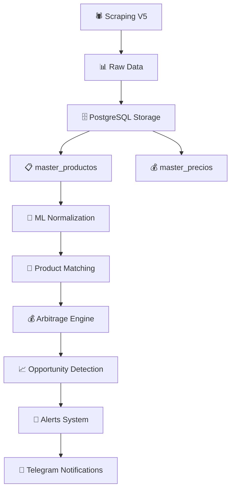

# 🔄 FLUJO DEL SISTEMA - Normalización y Matchmaking

## 📊 Arquitectura del Sistema

El sistema sigue un flujo secuencial bien definido donde cada componente tiene responsabilidades específicas:

### 🚀 **1. SCRAPING (Scrapers V5)**

```
📱 Retailers → 🕷️ Scrapers V5 → 📊 Datos Raw
```

**Responsabilidades:**
- Extraer productos brutos de retailers (Ripley, Falabella, Paris, etc.)
- Generar datos raw sin procesar 
- **NO realizar normalización** en tiempo real
- Mantener datos originales tal como los proporciona el retailer

**Ubicación:** `portable_orchestrator_v5/scrapers/`

### 💾 **2. BASE DE DATOS (Storage Layer)**

```
📊 Datos Raw → 🗄️ PostgreSQL → 📋 Códigos Internos Únicos
```

**Tablas principales:**
- **`master_productos`**: Productos con códigos internos únicos
- **`master_precios`**: Precios + referencias temporales

**Formato de códigos internos:**
```
CL-[BRAND]-[MODEL]-[SPEC]-[RETAILER]-[SEQ]
Ejemplo: CL-SAMS-GALAXY-256GB-RIP-001
```

**Características clave:**
- Cada retailer mantiene códigos internos independientes
- Un mismo producto físico tiene múltiples códigos (cross-retailer)
- Permite comparación de precios entre retailers
- Base para detección de arbitraje

### 🤖 **3. NORMALIZACIÓN Y MATCHMAKING (ML Layer)**

```
🗄️ PostgreSQL → 🧠 ML Processing → 🔗 Product Matching
```

**Proceso:**
1. **Post-procesamiento**: Opera DESPUÉS de que datos están en BD
2. **Lectura**: Lee desde `master_productos` para comparación
3. **ML Matching**: Usa `MatchScoringModel` con embeddings semánticos
4. **Similarity Scoring**: Umbral configurable (típicamente 0.85)
5. **Cross-Retailer Matching**: Identifica mismo producto en diferentes retailers

**Componentes principales:**
- `ArbitrageMLIntegration`: Conecta ML con base de datos
- `MatchScoringModel`: Algoritmo de similitud semántica
- Embeddings multilingües para productos en español

**Ubicación:** `arbitrage/ml_integration.py`

### 💰 **4. ARBITRAJE (Opportunity Detection)**

```
🔗 Matched Products → 📈 Price Analysis → 🚨 Opportunities
```

**Input:** Productos ya normalizados y matcheados
**Proceso:**
1. **Price Comparison**: Compara precios entre retailers matcheados
2. **Margin Calculation**: Calcula márgenes brutos y ROI
3. **Filtering**: Aplica umbrales configurables
4. **Alert Generation**: Genera alertas automáticas

**Umbrales típicos:**
- Margen mínimo: $15,000 CLP
- ROI mínimo: 12%
- Confidence score: >0.85

**Ubicación:** `portable_orchestrator_v5/arbitrage_system/`

## 🔄 **Flujo Completo Integrado**



## ⚙️ **Configuración del Sistema**

### ML Configuration
```python
# arbitrage/ml_integration.py
config = {
    'min_similarity_score': 0.85,        # Umbral de similitud ML
    'min_margin_clp': 15000,             # Margen mínimo en CLP
    'min_percentage': 12.0,              # ROI mínimo en %
    'max_price_ratio': 5.0               # Evitar matchings absurdos
}
```

### Alerts Configuration
```python
# core/alerts_config.py
ARBITRAGE_MIN_MARGIN = 15000     # CLP mínimo para alertar
PRICE_CHANGE_THRESHOLD = 5.0     # % mínimo cambio de precio
TELEGRAM_ALERTS_ENABLED = true   # Habilitar notificaciones
```

## 🎯 **Casos de Uso Principales**

### **Cross-Retailer Price Comparison**
```
Samsung Galaxy S24 256GB:
- Falabella: $899.990 (CL-SAMS-GALAXY-256GB-FAL-001)
- Ripley: $799.990 (CL-SAMS-GALAXY-256GB-RIP-001)
→ Oportunidad: $100k CLP (11.1% ROI)
```

### **Arbitrage Detection Pipeline**
1. ML detecta productos similares entre retailers
2. Compara precios automáticamente
3. Identifica diferencias significativas (>$15k)
4. Envía alerta via Telegram con detalles
5. Permite acción inmediata del usuario

## 🛡️ **Robustez del Sistema**

### **Error Handling**
- Fallback a matching básico si ML falla
- Reconexión automática a base de datos
- Circuit breakers para evitar cascading failures
- Logs detallados para debugging

### **Performance**
- Cache inteligente L1-L4 en Redis
- Índices optimizados en PostgreSQL
- Procesamiento asíncrono
- Batch processing para eficiencia

### **Monitoring**
- Métricas en tiempo real
- Performance tracking
- Success/failure rates
- Alert delivery confirmation

## ✅ **Validación del Flujo**

**Status actual del sistema:**
- ✅ 5,487 productos únicos en base
- ✅ 0 duplicados por SKU+retailer
- ✅ 9 productos cross-retailer correctos
- ✅ ML integration funcional
- ✅ Alertas integradas con Telegram
- ✅ Sistema de arbitraje operativo

**El flujo está correctamente implementado y operativo.**